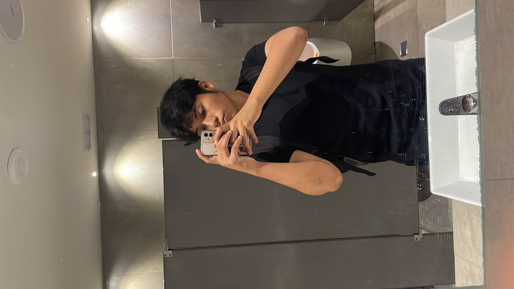

  

<h1 align="center">MatSpace 🎓📐</h1>

  <strong>Optimización y gestión académica para la comunidad de la Facultad de Matemáticas - UADY.</strong>

r.

---

## 🚀 Propósito del Proyecto
El objetivo de MatSpace es resolver la fragmentación de información y simplificar la reserva de recursos dentro de la facultad, permitiendo que los alumnos se enfoquen en su desempeño académico.

## ✨ Características Principales
* **📅 Control Escolar:** Visualización de horarios y calendario oficial.
* **📢 Eventos y Charlas:** Cartelera digital de conferencias y talleres.
* **🏢 Gestión de Espacios:** Consulta de disponibilidad de salones en tiempo real.
* **📚 Reservaciones:** Sistema de apartado para cubículos de la biblioteca.

---

## 👥 Equipo de Desarrollo

| [ **Rodrigo Salazar**](https://www.linkedin.com/in/rodrigo-israel-salazar-a826432b0/) | [ **Misael Alcocer**](https://www.linkedin.com/in/URL_DE_LINKEDIN_MISAEL) | [ **Leonardo San Martín**](https://www.linkedin.com/in/URL_DE_LINKEDIN_LEONARDO) | [ **Javier Toache**](https://www.linkedin.com/in/URL_DE_LINKEDIN_JAVIER) |
| :---: | :---: | :---: | :---: |
| **Líder de Proyecto** | **Desarrollo Técnico** | **Desarrollo Técnico** | **Documentación** |
| Front, Creatividad y Mockups | Arquitectura e Implementación | Arquitectura e Implementación | Gestión de Procesos |

---

---
Desarrollado con ❤️ para la comunidad de la Facultad de Matemáticas - UADY.